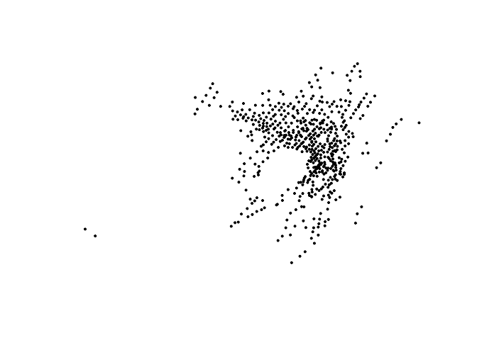
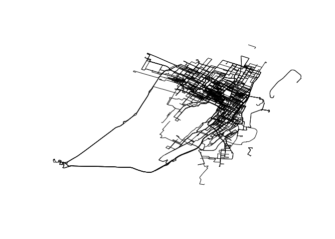
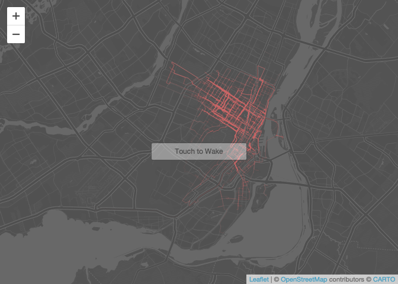

Vignette
========

    library(stplanr)
    library(dplyr) 
    ## 
    ## Attaching package: 'dplyr'
    ## The following objects are masked from 'package:stats':
    ## 
    ##     filter, lag
    ## The following objects are masked from 'package:base':
    ## 
    ##     intersect, setdiff, setequal, union
    library(leaflet)
    library(gbfs)
    library(sp)
    library(maptools)
    ## Checking rgeos availability: TRUE
    library(mapdeck)
    library(leaflet.extras)

    possible_cities <- get_gbfs_cities()
    possible_cities

    get_gbfs(city = "Montreal, QC", feeds = "all", directory = "BIKI_data")

    list.files("BIKI_data")

    station_status <- readRDS("data/BIKI_data/station_status.rds")
    head(station_status)

    ##   station_id num_bikes_available num_bikes_disabled num_docks_available
    ## 1         25                  21                  1                  67
    ## 2         42                  10                  0                   9
    ## 3         51                  86                  1                  18
    ## 4         75                   9                  0                   6
    ## 5        532                  13                  0                  10
    ## 6          1                  25                  0                   8
    ##   num_docks_disabled is_installed is_renting is_returning        last_updated
    ## 1                  0         TRUE       TRUE         TRUE 2019-10-09 14:49:42
    ## 2                  0         TRUE       TRUE         TRUE 2019-10-09 14:56:26
    ## 3                  0         TRUE       TRUE         TRUE 2019-10-09 14:49:01
    ## 4                  0         TRUE       TRUE         TRUE 2019-10-09 14:53:17
    ## 5                  0         TRUE       TRUE         TRUE 2019-10-09 14:36:15
    ## 6                  0         TRUE       TRUE         TRUE 2019-10-09 14:58:13
    ##   year month day hour minute
    ## 1 2019    10   9   14     49
    ## 2 2019    10   9   14     56
    ## 3 2019    10   9   14     49
    ## 4 2019    10   9   14     53
    ## 5 2019    10   9   14     36
    ## 6 2019    10   9   14     58

    station_info <- readRDS("data/BIKI_data/station_information.rds")
    head(station_info)

    ##   station_id                          external_id
    ## 1         25 0b100854-08f3-11e7-a1cb-3863bb33a4e4
    ## 2         42 0b102046-08f3-11e7-a1cb-3863bb33a4e4
    ## 3         51 0b102e96-08f3-11e7-a1cb-3863bb33a4e4
    ## 4         75 0b106d46-08f3-11e7-a1cb-3863bb33a4e4
    ## 5        532 0b15de58-08f3-11e7-a1cb-3863bb33a4e4
    ## 6          1 0b0fda98-08f3-11e7-a1cb-3863bb33a4e4
    ##                                           name short_name      lat       lon
    ## 1        de la Commune / Place Jacques-Cartier       6026 45.50761 -73.55184
    ## 2 Square Victoria (Viger / du Square-Victoria)       6043 45.50206 -73.56295
    ## 3                         de la Commune / King       6052 45.49752 -73.55257
    ## 4                              Square Phillips       6083 45.50374 -73.56811
    ## 5                        Casgrain / St-Viateur       7019 45.52751 -73.59879
    ## 6      Métro Champ-de-Mars (Viger / Sanguinet)       6001 45.51035 -73.55651
    ##    rental_methods capacity electric_bike_surcharge_waiver
    ## 1 CREDITCARD, KEY       89                          FALSE
    ## 2 CREDITCARD, KEY       19                          FALSE
    ## 3 CREDITCARD, KEY      105                          FALSE
    ## 4 CREDITCARD, KEY       15                          FALSE
    ## 5 CREDITCARD, KEY       23                          FALSE
    ## 6 CREDITCARD, KEY       33                          FALSE
    ##   eightd_has_key_dispenser
    ## 1                    FALSE
    ## 2                    FALSE
    ## 3                    FALSE
    ## 4                    FALSE
    ## 5                    FALSE
    ## 6                    FALSE
    ##                                                                                                                                                                                eightd_station_services
    ## 1 9ea7549c-5b8f-4bd2-a2bb-d54c5b71f6e6, ATTENDED_SERVICE, LIMITED, LIMITED, Depot Station, , Saturday and Sunday from 11:00 AM to 19:00 PM, https://www.bixi.com/en/bixi-manulife-valets-2018-schedule
    ## 2     e9861aaa-92f9-4307-a413-d886d6a40d20, ATTENDED_SERVICE, LIMITED, LIMITED, Depot Station, , Monday to Friday from 7:00 AM to 19:00 PM, https://www.bixi.com/en/bixi-manulife-valets-2018-schedule
    ## 3      78b0394b-5b74-4020-913f-d3f153e43f0e, ATTENDED_SERVICE, LIMITED, LIMITED, Depot station, , Monday to Friday from 8h30 am to 7h30 pm, https://www.bixi.com/en/bixi-manulife-valets-2018-schedule
    ## 4            504d4b55-8410-4de7-b4b3-ca9a3671b433, ATTENDED_SERVICE, LIMITED, LIMITED, Depot station, , Monday to Friday from 7 am to 6 pm, https://www.bixi.com/en/bixi-manulife-valets-2018-schedule
    ## 5     0f61a55f-6692-4d4b-92b4-4d3a6582adf0, ATTENDED_SERVICE, LIMITED, LIMITED, Depot Station, , Monday to Friday from 8:00 AM to 08:00 PM, https://www.bixi.com/en/bixi-manulife-valets-2018-schedule
    ## 6                                                                                                                                                                                                 NULL
    ##   has_kiosk
    ## 1      TRUE
    ## 2      TRUE
    ## 3      TRUE
    ## 4      TRUE
    ## 5      TRUE
    ## 6      TRUE

    system_info <- readRDS("data/BIKI_data/system_information.rds")
    head(system_info)

    ##   system_id language     name short_name operator                      url
    ## 1  Bixi_MTL       en Bixi_MTL                     http://montreal.bixi.com
    ##   purchase_url start_date phone_number email license_url         timezone
    ## 1              2016-03-24                                America/Montreal

    station_info <- read.csv("data/BIKI_data/Stations_2018.csv")
    #read.csv("BIKI_data/OD_2018-04.csv")
    #read.csv("BIKI_data/OD_2018-05.csv")
    flow <- read.csv("data/BIKI_data/OD_2018-06.csv")[,c(2, 4, 1, 3, 5, 6)]
    #read.csv("BIKI_data/OD_2018-07.csv")
    #read.csv("BIKI_data/OD_2018-08.csv")
    #read.csv("BIKI_data/OD_2018-09.csv")
    #read.csv("BIKI_data/OD_2018-10.csv")
    names(flow)

    ## [1] "start_station_code" "end_station_code"   "start_date"        
    ## [4] "end_date"           "duration_sec"       "is_member"

    station_points <- SpatialPointsDataFrame(coords =cbind(station_info$lon, station_info$lat), data = station_info)
    plot(station_points, pch=19, cex=0.4)

time … corpuscular .. track sunrise window Solar()

    travel_network <- od2line(flow = flow[30000:31000,], zones = station_points)
    w <- flow$is_member / max(flow$is_member) *1

    intrazone <- travel_network$start_station_code == travel_network$end_station_code
    travel_network <- travel_network[!intrazone,]
    t_routes <- line2route(travel_network, route_fun = route_osrm ) 
    #route_graphhopper
    plot(t_routes)
    t_routes$All <- travel_network$All

    rates <- cbind(t_routes$id, t_routes$distance / t_routes$duration)
    rownames(rates) <- t_routes$id
    colnames(rates) <- c("id","rates")

    rates_t_routes <- merge(t_routes, rates, by.x="id")
    rates_t_routes@data$rates  <- as.numeric(rates_t_routes@data$rates )
    rates_t_routes@data$rates[which(rates_t_routes@data$rates == 0)] <- NA

    save(rates_t_routes, file="data/BIKI_data/rates_t_routes.Rdata")
    plot(rates_t_routes)

    plot(rates_t_routes)

    rnet <- overline(rates_t_routes, attrib = "rates", fun = sum, na.zero =FALSE)
    save(rnet, file="data/BIKI_data/rnet.Rdata")

BIXI average speed

    leaflet() %>% 
      addProviderTiles("CartoDB.DarkMatterNoLabels")%>% addPolylines(data = rnet, col="firebrick",  
      opacity=1, weight = rnet@data$rates/6000
      )  %>% suspendScroll()

    data(occ.landscape)
    data(param1)

    #Simulating the occupation in the next time step:

    landscape2 <- spom(sp=occ.landscape,
                kern="op1",
                conn="op1",
                colnz="op1",
                ext="op1",
                param_df=param1,
                beta1=NULL,
                b=1,
                c1=NULL,
                c2=NULL,
                z=NULL,
                R=NULL,
                succ="none"
                )

    #The output has two new columns in the data frame nodes.characteristics: species2 
    #(occupation in the next time step) and turn (turnover - change of occupation status, 
    #1 if changed and 0 if not).:
    landscape2

    library(leaflet)
    library(htmltools)
    library(htmlwidgets)

    # Convert the JS and CSS from
    # https://github.com/mapshakers/leaflet-icon-pulse/tree/master/src
    # to proper URLs using rawgit.com
    pluginDependency <- htmlDependency(
      "leaflet-icon-pulse",version = "1.0",
      src = c(href="https://rawgit.com/mapshakers/leaflet-icon-pulse/master/src/"),
      script = "L.Icon.Pulse.js",stylesheet ="L.Icon.Pulse.css"
    )

    registerPlugin <- function(map, plugin) {
      map$dependencies <- c(map$dependencies, list(plugin))
      map
    }

    #station_points <- SpatialPointsDataFrame(coords =cbind(station_info$lon, station_info$lat), data = station_info)
    #plot(station_points, pch=19, cex=0.4)
    library(jsonlite)
    station_pts <- matrix(cbind(station_points$latitude, station_points$longitude), length(station_points$latitude), 2)
    colnames(station_pts)<- c("lat","lon")
    station_pts_json <- toJSON(station_pts[1,])

    leaflet() %>%
      addProviderTiles("CartoDB.DarkMatter") %>%
      setView(-73.5772, 45.5048, zoom = 12) %>%
      registerPlugin(pluginDependency) %>%
      onRender("function(el,x, data) {
                       
              var pulsingIcon =
                 L.icon.pulse({iconSize:[5,5],color:'red',heartbeat:0.5});
               var pulsingIcon2 =
                 L.icon.pulse({iconSize:[10,10],color:'orange',heartbeat:2});
               var marker =
                 L.marker(data,{icon: pulsingIcon}).bindPopup(
                   '<b>Hello world!</b> I am a popup.').openPopup().addTo(this);
               var marker =
                 L.marker([45.5048,-73.5772],{icon: pulsingIcon2}).addTo(this);
               }", data=station_pts_json)  %>% suspendScroll()

    #icon.pop <- pulseIcons(color = ifelse(cities$Pop <500000,'blue','red'),
     #                      heartbeat = ifelse(cities$Pop<500000,'0.8','0.4'))

    popIcons <- pulseIconList(
      blue = makePulseIcon(color="blue", heartbeat = 1, iconSize = 12),
      red = makePulseIcon(color="red", heartbeat = 1, iconSize = 15, animate =  FALSE)
    )

    leaflet() %>%
      addProviderTiles("CartoDB.DarkMatter") %>%
      setView(-73.5772, 45.5048, zoom = 12) %>%
      addPulseMarkers(
        lng=station_pts[,2], lat=station_pts[,1],
        label='This is a label',
        icon = popIcons
     
        
        ) %>% suspendScroll()
