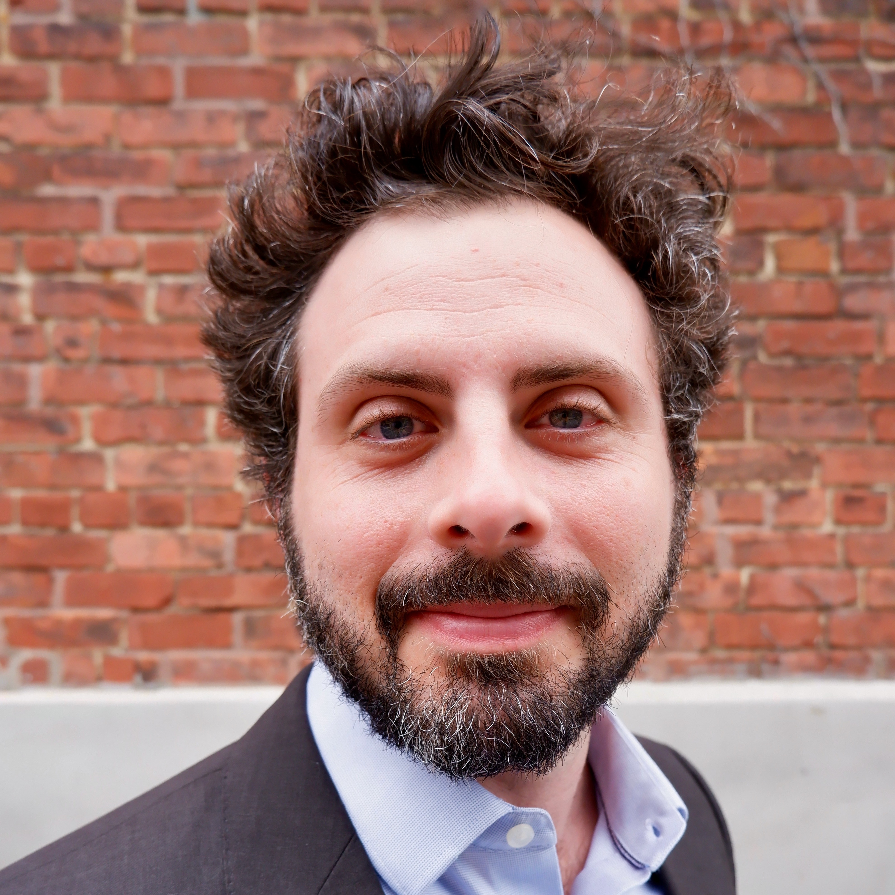
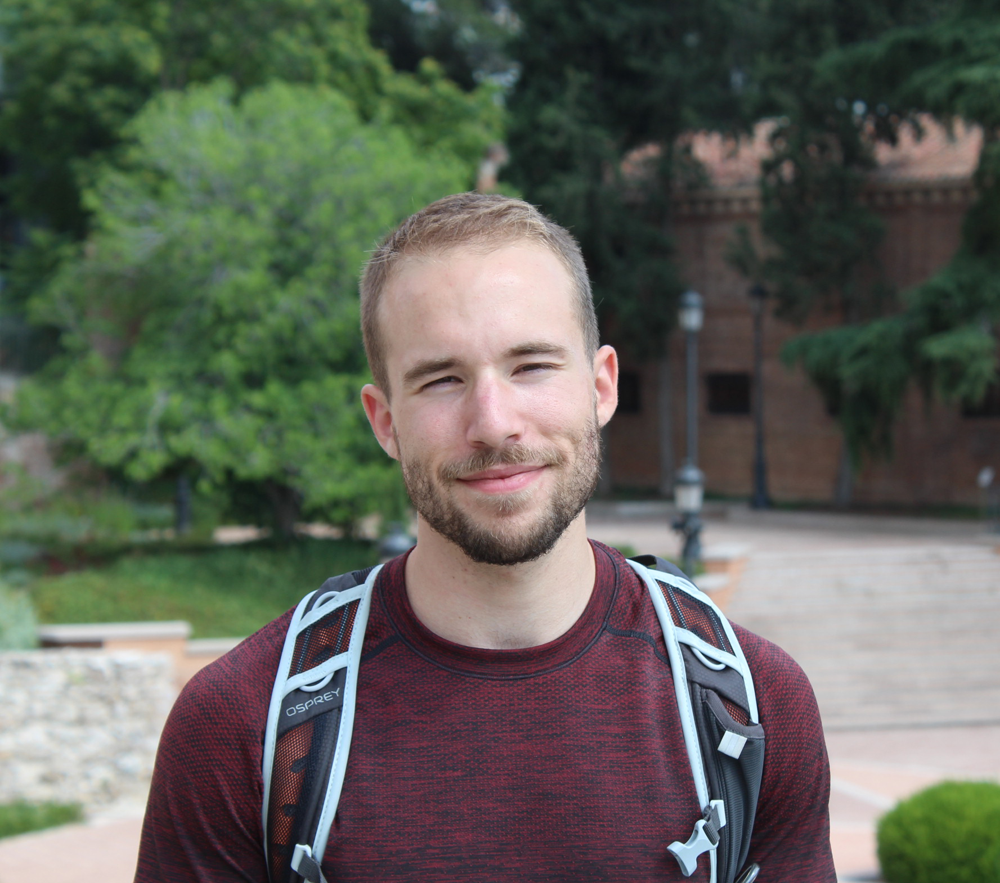
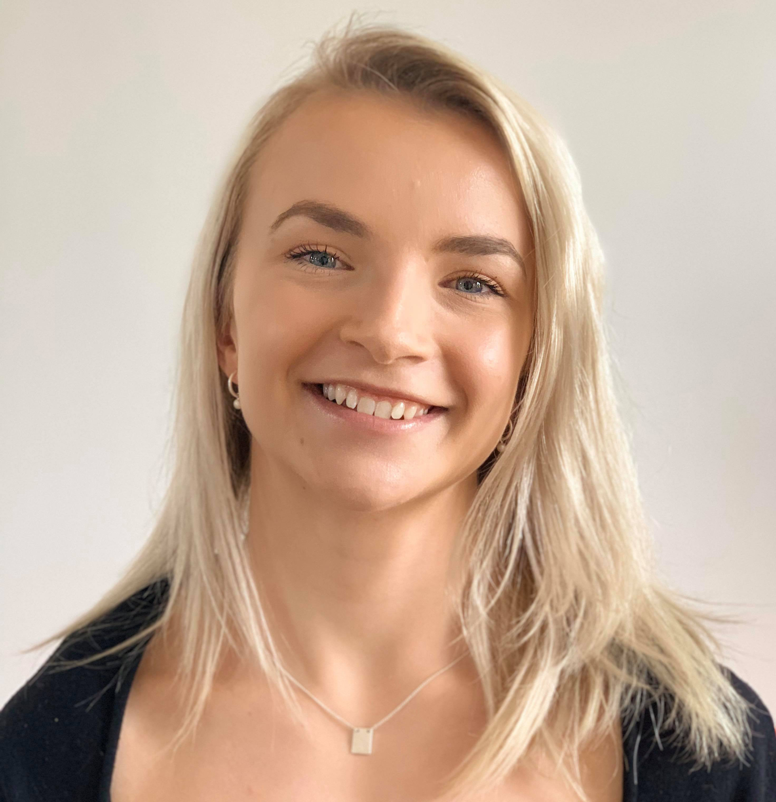

```{r setup, include=FALSE}
knitr::opts_chunk$set(echo = FALSE)

# The code chunk named css includes all the css for this page. It's exported to all the SUS app, so everything in that css chunk should be starting by '.meet_the_team', so that it's applied only in the content of this script. 'meet_the_team' is the name of the divs' class used here. Every other code chunk which is the presentation for each individual team member should be preceded by '<div class="meet_the_team">' and ended with '</div>' to indicate that every code chunk is a new div, with the 'meet_the_team' css class taken. 

```

```{css}

.meet_the_team {
  position: relative;
  min-height: 250px;
  margin: 30px;
  border-spacing: 15px;
  padding: 25px 25px 25px 25px;
  box-shadow: 0 1px 3px rgba(0,0,0,0.12), 0 1px 2px rgba(0,0,0,0.24);
  transition: all 0.5s cubic-bezier(.25,.8,.25,1);
  align-content: center;
  max-width:1000px;
}

.meet_the_team:hover {
  border-top-left-radius: 15px;
  border-bottom-left-radius: 15px;
  animation-name: example;
  animation-duration: 0.25s;
  border-left: 8px solid #00a65a;
  box-shadow: 0 14px 28px rgba(0,0,0,0.25), 0 10px 10px rgba(0,0,0,0.22);
}

.meet_the_team img {
  position: absolute;
  width: 200px;
  height: 200px;
  margin: 0 auto;
    margin-right: 50px;
    object-fit: cover;
  border-radius: 50%;
    border-top-left-radius: 50%;
    border-top-right-radius: 50%;
    border-bottom-right-radius: 50%;
    border-bottom-left-radius: 50%;
  transition: transform 0.5s;
}

.meet_the_team img:hover {
  transform: scale(1.05);
  # padding-bottom:5px;
  box-shadow: 0 14px 28px rgba(0,0,0,0.1);
}

.meet_the_team p.caption {
    margin-left: 225px;
}

.meet_the_team a{
  color: #1a97cb;
}


```

<div class="meet_the_team">
```{r david_Wachsmuth,  fig.cap="<strong><big><a href = 'https://upgo.lab.mcgill.ca/' target='_blank'>David Wachsmuth</a></big></strong><br>David Wachsmuth est titulaire de la chaire de recherche du Canada en gouvernance urbaine à l’Université McGill, où il est également professeur associé à l’École d’urbanisme. Il dirige UPGo, le groupe de recherche sur la politique et la gouvernance urbaines de McGill, où il est chargé d’une équipe de chercheur(e)s qui étudient les problèmes pressants en gouvernance urbaine liés au développement économique, à la durabilité environnementale et aux marchés du logement. Il est codirecteur du projet ‘Adapter les environnements urbains pour l’avenir’ de l’Initiative Systémique de McGill sur la Durabilité, où il fait partie d’une vaste équipe interdisciplinaire qui élabore de nouvelles façons de conceptualiser, de mesurer et d’améliorer la durabilité urbaine. L’un des principaux axes de son travail consiste à expliquer la transition, en matière de politique et de planification, entre l’identification de la ville comme un problème de durabilité globale et l’identification de la ville comme une solution aux problèmes de durabilité globale. Il est l’un des plus grands experts mondiaux de l’impact des plateformes de location à court terme telles que Airbnb sur les villes du monde entier, et consulte largement les municipalités et les organisations communautaires pour concevoir des réglementations appropriées. Dr. Wachsmuth a publié de nombreux articles dans les plus grandes revues d’études urbaines, de planification et de géographie, et ses travaux ont été largement couverts par les médias nationaux et internationaux, notamment le New York Times, le Wall Street Journal, l’Associated Press et le Washington Post. Il est aussi rédacteur en début de carrière de la revue <i>Territory, Politics, Governance</i> et siège au comité éditorial de la revue <i>Urban Geography</i>."}



```
</div>

<div class="meet_the_team">
```{r robin_basalaev_binder,  fig.cap="<strong><big><a href = '' target='_blank'>Robin Basalaev-Binder</a></big></strong><br>Robin a terminé sa maîtrise en urbanisme en 2018 à l’Université McGill. Sa passion pour la justice sociale et raciale, l’équité, ainsi que pour le logement abordable et accessible, l’a amenée à poursuivre des recherches centrées sur ces questions. Ses recherches sur le développement durable se concentrent sur l’accès et l’équité au Canada, ainsi que sur les disparités présentes dans les approches centrées sur les villes intelligentes. Elle a également mené des études sur la gentrification, la résilience urbaine, et les locations à court terme dans le système du logement, ainsi que sur l’intersection entre l’immigration et le logement. Robin s’intéresse particulièrement à la manière dont les communautés marginalisées par le système et les personnes ayant un statut d’immigration vulnérable peuvent participer aux processus de planification urban et à l’activisme en milieu urbain. Son travail se concentre sur les contextes américain, canadien et latino-américain. Elle prévoit poursuivre ses recherches en tant que doctorante en urbanisme en 2021."}


```
</div>

<div class="meet_the_team">
```{r samuel_kohn,  fig.cap="<strong><big><a href = 'https://www.linkedin.com/in/kohnsamuel/' target='_blank'>Samuel Kohn</a></big></strong><br>D’origine française et américaine, Samuel Kohn débute sa carrière d’urbaniste et est couramment inscrit dans le programme de Maitrise en Urbanisme à l’Université de McGill. Il vise à contribuer à la conception durable des villes du futur ainsi qu’au bien-être des citadins urbains. Il ambitionne de se spécialiser dans les projets de Villes Intelligentes axés sur la transparence et la gouvernance démocratique tout en se basant sur des connaissances collectives et empiriques complémentées par des données de masses afin d’avoir un impact positif sur le bien-être, la durabilité, et la résistance des villes. Du fait de son implication dans le développement du tableau de bord interactif SUS, Samuel a pu développer de manière considérable ses compétences de SIG, de visualisation de données, et de recherche appliquée. Samuel est bilingue (français / anglais) et détient un diplôme de l’Université de McGill avec un BA en Développement International. Samuel a également plus de 6 ans d’expérience dans le domaine du développement économique, se spécialisant dans l’accompagnement d’agences gouvernementales à l’échelle globale afin d’établir et exécuter leurs stratégies d’investissement direct à l’étranger."}


```
</div>

<div class="meet_the_team">
```{r maxime_belanger_de_blois, fig.cap="<strong><big><a href = 'https://www.linkedin.com/in/maximebdeblois' target='_blank'>Maxime Bélanger De Blois</a></big></strong><br>Actuellement étudiant à la maîtrise en urbanisme de l'Université McGill, Maxime a précédemment obtenu un baccalauréat intégré en économie et politique à l'Université Laval avec mention d'honneur et inscrit sur le tableau d'honneur de sa faculté. En parallèle, il a obtenu un microprogramme en langue espagnole. En tant qu'étudiant au premier cycle, il s'est penché sur l'application des idées de développement durable aux théories économiques. Ses intérêts académiques actuels portent sur l'application des concepts politiques et économiques aux enjeux territoriaux et environnementaux. Dans la poursuite de ces objectifs, il estime que les techniques d'analyse et de visualisation des données sont essentielles. Il est actuellement assistant de recherche au sein du groupe de recherche sur la gouvernance et les politiques urbaines UPGo, où il se concentre sur l'analyse et les impacts du marché de la location à court-terme dans les villes nord-américaines dans le contexte de la COVID-19."}



```
</div>

<div class="meet_the_team">
```{r cloe_st_hilaire, fig.cap="<strong><big><a href = 'https://www.linkedin.com/in/clo%C3%A9-st-hilaire-b26020117/' target='_blank'>Cloé St-Hilaire</a></big></strong><br>Cloé St-Hilaire est présentement étudiante à la maîtrise en urbanisme à l’Université McGill. Elle a obtenu un baccalauréat en commerce, avec une majeure en gestion du développement durable et en études urbaines en 2019. Elle a mis en pratique sa formation en travaillant dans le secteur de l’économie sociale en tant qu’analyste de la sécurité alimentaire pour une start-up se spécialisant en aquaponie. Cloé a également travaillé à la promotion de l’entreprenariat féminin dans des entreprises agricoles sénégalaises dirigées par des femmes. Ses intérêts de recherche se situent à l’intersection du droit au logement, de la financiarisation et de l’implication des plateformes dans le secteur de l’habitation. Elle travaille comme assistante de recherche au sein du groupe UPGo, travaillant à la fois sur la dynamique des marchés locatifs à court et long terme ainsi que sur le tableau de bord de la durabilité."}



```
</div>
